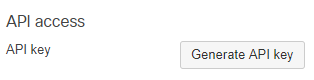

# Meraki Network VLAN Provision
Python script that creates networks, adds devices, and creates vlans in Meraki based on input from a .csv file

## Requirements

* Python 3.6+
* Administrator access to Meraki Dashboard

## To run

Data is read from meraki_config.csv.  Columns are delimited with comma and devices are delimited with semi-colon.  VLAN_subnet column allows you to dictate the IP address space the VLANs will be created in.  Those VLANS will be created incrementally and reference back to the MX assigned to the network. **NOTE** to add vlans an MX MUST be assigned to the network.  If the network does not include an MX device, set the Number_VLANS to 0 for that row.  Once the meraki_config.csv file is complete and the virutal environment is created:

### How to run the script:

#### Generate your Meraki API Key

1. Access the [Meraki dashboard](dashboard.meraki.com).
2. For access to the API, first enable the API for your organization under Organization > Settings > Dashboard API access.
<p align="center"></p>
3. After enabling the API, go to "my profile" on the upper right side of the dashboard to generate an API key. This API key will be associated with the Dashboard Administrator account which generates it, and will inherit the same permissions as that account.  You can generate, revoke, and regenerate your API key on your profile.
<p align="center"></p>
<p align="center"></p>
**Always keep your API key safe as it provides authentication to all of your organizations with the API enabled. If your API key is shared, you can regenerate your API key at any time. This will revoke the existing API key.**

#### Storing the Meraki API Key as an environment variable
Once the API key is obtained, you'll need to store the Meraki dashboard API key as an environment variable:
`export MERAKI_KEY = <YOUR MERAKI API KEY>`

create a virtual environment:
```
python<version> -m venv merakivlan
source merakivlan/bin/activate
```

and install the Meraki SDK via `pip install -r requirements.txt`

### To create networks
```bash
python meraki_network_vlan_provision.py -c
```

### To delete all networks
```bash
python meraki_network_vlan_provision.py -d
```

----
### Licensing info
Copyright (c) 2020 Cisco and/or its affiliates.

This software is licensed to you under the terms of the Cisco Sample
Code License, Version 1.1 (the "License"). You may obtain a copy of the
License at

               https://developer.cisco.com/docs/licenses

All use of the material herein must be in accordance with the terms of
the License. All rights not expressly granted by the License are
reserved. Unless required by applicable law or agreed to separately in
writing, software distributed under the License is distributed on an "AS
IS" BASIS, WITHOUT WARRANTIES OR CONDITIONS OF ANY KIND, either express
or implied.
